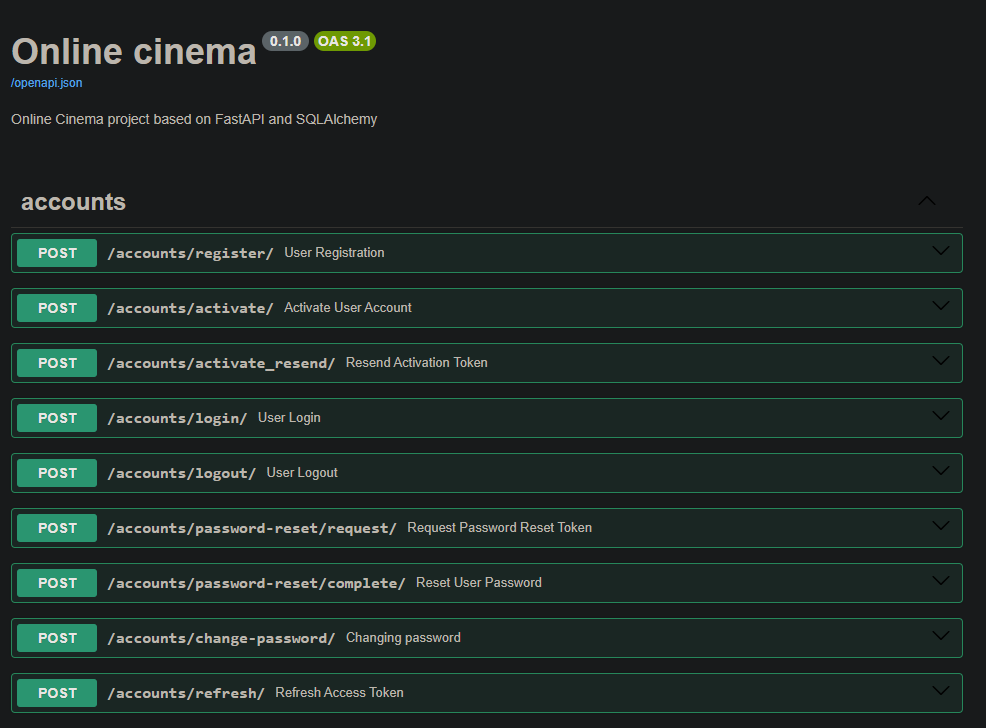
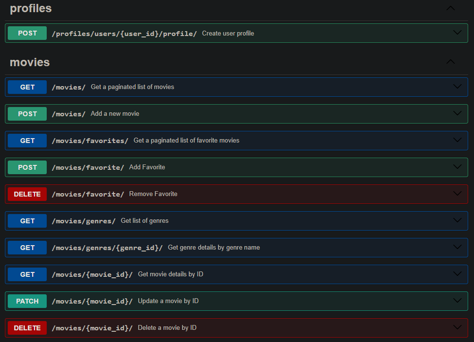
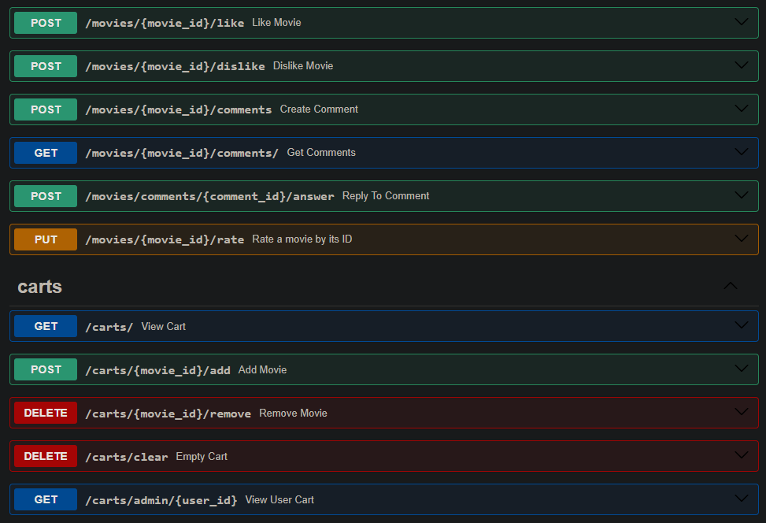
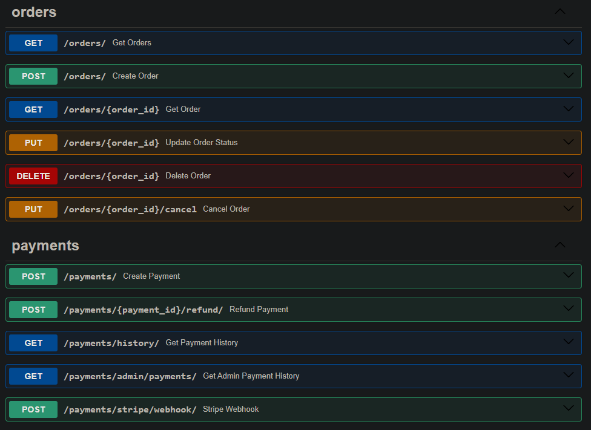

# FastAPI Online Cinema

Application enabling users to browse, search, like, comment and buy movies. Built with the FastAPI framework, it uses SQLAlchemy for database management with PostgreSQL.

## Features

+ JWT authentication
+ User registration with email activation
+ Password reset functionality
+ User profile management
+ User roles (admin, user)
+ Movie management (CRUD operations for admins)
+ Movie search and filtering
+ Movie rating, like and dislikes
+ Comment movies and answer comments
+ Cart management
+ Order management
+ Payment processing (using Stripe)
+ Email notifications

## Installing / Getting started

### 1. Clone project from GitHub to local computer.

Open the Git Bash console in the directory where you want to place the project and run command:
```
git clone git@github.com:V-Shkrobatskyi/py-fastapi-online-cinema.git
```

### 2. Create and activate virtual environment

Open the project and run command:
```
python -m .venv venv
```

To activate virtualenv:

a) On windows:
```
source .venv\Scripts\activate
```

b) On mac:
```
source .venv/bin/activate
```

### 3. Installing project dependencies

This project uses Poetry to manage its dependencies. Install them using the following command:
```
# Install Poetry if not already installed
pip install poetry

# Install project dependencies
poetry install
```

### 4. Create a .env file

Rename `.env.sample` file to `.env`. Open it and add the all variables to it. Enter your database connection details and other necessary configuration settings into the .env file.

### 5. Run project with docker

The project is Dockerized for easy setup. 
To start ALL services (PostgreSQL, pgAdmin, MailHog, MinIO, Alembic migrator and include FastAPI app), run:
```
docker-compose -f docker-compose.yml up --build
```

### 6. Run project locally 

Start required services without FastAPI app:
```
docker-compose -f docker-compose-local.yml up --build
```

Move to src folder and run FastAPI app in console:
```
cd src
poetry run uvicorn main:app
```

### 7. Access the Services:

| Service        | URL |
|---------------|--------------------------|
| **API**       | `http://localhost:8000` |
| **pgAdmin**   | `http://localhost:3333` (Use `.env` credentials) |
| **MailHog UI** | `http://localhost:8025` (SMTP testing) |
| **MinIO Console** | `http://localhost:9001` (S3-compatible storage) |

---

## Endpoints Example









